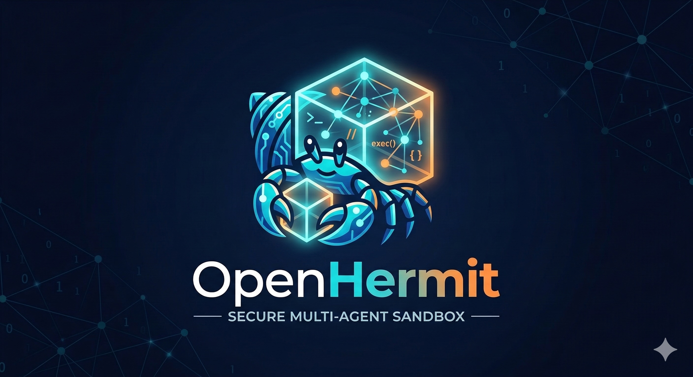

# OpenHermit

**Stop running AI agents on your laptop. Deploy, manage, and scale them as production services.**

A multi-agent platform for deploying and managing autonomous AI agents at scale, with centralized state management, multi-user access control, and sandboxed execution.

Like a hermit crab living inside its protective shell, each agent operates inside its own container — protected, autonomous, and able to interact with the outside world safely.



## Why OpenHermit

Most open-source agent frameworks are designed as single-user, single-agent tools running on the developer's local machine. OpenHermit takes a different approach:

**Platform-first architecture.** OpenHermit is built to deploy and manage many agents on a shared infrastructure. A central gateway manages agent lifecycles, a shared PostgreSQL database holds all internal state, and a unified API exposes everything for automation.

**Centralized internal state.** Agent state — sessions, messages, memories, instructions, user data — is separated from the agent's working files and stored in a shared database with row-level `agent_id` scoping. This means internal state is queryable, backupable, and manageable from a single place, rather than scattered across per-agent file systems or containers.

**Multi-user agents.** Each agent is not a one-to-one personal assistant. Multiple users can interact with the same agent through CLI, web, or channel adapters (e.g. Telegram). Users are identified and tracked across sessions, with a three-tier role model (owner / user / guest) controlling what each user can do.

**Clean component boundaries.** The system is split into focused packages — `agent`, `gateway`, `cli`, `web`, `channels` — communicating through explicit APIs. A multi-protocol transport layer (HTTP sync, HTTP streaming, WebSocket) provides clean integration points for external systems.

**Sandboxed execution.** Each agent runs code inside its own Docker workspace container. The workspace is mounted at `/workspace`, and all `exec` commands run inside this container, isolating agent actions from the host.

## Architecture Overview

```text
                    ┌─────────────┐
                    │   Gateway    │  Control plane: agent lifecycle, routing, auth
                    └──────┬──────┘
                           │
              ┌────────────┼────────────┐
              │            │            │
         ┌────┴────┐ ┌────┴────┐ ┌────┴────┐
         │ Agent A │ │ Agent B │ │ Agent C │  In-process runtimes
         └────┬────┘ └────┬────┘ └────┬────┘
              │            │            │
         ┌────┴────┐ ┌────┴────┐ ┌────┴────┐
         │Container│ │Container│ │Container│  Docker workspace containers
         └─────────┘ └─────────┘ └─────────┘

         ┌──────────────────────────────────┐
         │          PostgreSQL              │  Shared internal state store
         └──────────────────────────────────┘
```

### Key Design Decisions

- **Internal vs external state.** Internal state (sessions, memories, instructions, users) lives in PostgreSQL. External state (project files, generated artifacts) lives in the workspace, mounted into the agent's container. The two never mix.
- **PostgreSQL over SQLite.** A shared database is essential for platform deployment — all agents' state is centrally managed, searchable, and backed up together, rather than distributed across per-agent files.
- **One workspace container per agent.** Rather than managing multiple container types, each agent gets a single persistent Docker container with the workspace mounted. This provides sufficient isolation while keeping the model simple.
- **Gateway as control plane.** The gateway manages agent lifecycle (create, start, stop, remove), proxies API requests to agent runtimes, and handles authentication. Agents are addressable via `/agents/{id}/...`.

## Repository Structure

```text
openhermit/
├── apps/
│   ├── agent/                # Agent runtime (model loop, tools, session management)
│   ├── gateway/              # Control plane (agent lifecycle, routing, auth)
│   ├── cli/                  # Platform CLI (hermit command)
│   ├── web/                  # Browser client
│   └── channels/
│       └── telegram/         # Telegram channel adapter
├── packages/
│   ├── protocol/             # Session/event contracts, route constants
│   ├── sdk/                  # Gateway client SDK
│   ├── shared/               # Common types and helpers
│   └── store/                # Store interfaces + Prisma/PostgreSQL adapters
└── docs/
```

## Installation

```bash
npm install -g openhermit
```

This provides the `hermit` (and `openhermit`) command.

For development:

```bash
git clone https://github.com/williamwa/openhermit.git
cd openhermit
npm install
```

## Quick Start

```bash
# 1. Interactive setup — database, admin token, JWT secret
hermit setup

# 2. Start the gateway
hermit gateway start

# 3. Verify everything is working
hermit status
hermit doctor

# 4. Chat with an agent
hermit chat
```

## CLI Reference

### Platform

| Command | Description |
|---------|-------------|
| `hermit setup` | Interactive setup wizard (database, tokens, `.env`) |
| `hermit gateway start\|stop\|run\|status` | Gateway daemon management |
| `hermit status` | Platform overview — gateway health + agent list |
| `hermit doctor` | Environment health checks |
| `hermit logs [-f] [-n N]` | View gateway logs |

### Agents

| Command | Description |
|---------|-------------|
| `hermit agents list` | List all agents |
| `hermit agents create <id>` | Create a new agent |
| `hermit agents start <id>` | Start an agent |
| `hermit agents stop <id>` | Stop an agent |
| `hermit agents remove <id>` | Remove a stopped agent |

### Chat

| Command | Description |
|---------|-------------|
| `hermit chat` | Interactive TUI chat |
| `hermit chat --agent-id <id>` | Chat with a specific agent |
| `hermit chat --resume` | Resume the last session |
| `hermit chat --session <name>` | Use a named session |

### Configuration

| Command | Description |
|---------|-------------|
| `hermit config show` | Show full agent config |
| `hermit config get <key>` | Get value by dot-path (e.g. `model.provider`) |
| `hermit config set <key> <value>` | Set value by dot-path |
| `hermit config secrets list` | List secrets (masked) |
| `hermit config secrets set <key> <value>` | Set a secret |
| `hermit config secrets remove <key>` | Remove a secret |

All agent-scoped commands accept `--agent-id <id>` (default: `main` or `$OPENHERMIT_AGENT_ID`).

## API

The gateway exposes a multi-protocol API for programmatic access:

- **HTTP sync** — `POST /agents/{id}/sessions/{sid}/messages?wait=true` — blocks until completion
- **HTTP streaming** — `POST /agents/{id}/sessions/{sid}/messages?stream=true` — inline SSE stream
- **WebSocket** — `ws://host/agents/{id}/ws` — bidirectional RPC with event subscriptions

See [docs/transport-protocol.md](docs/transport-protocol.md) for the full protocol specification.

## Internal State Model

All internal state is stored in PostgreSQL, scoped by `agent_id`:

| Store | Contents |
|-------|----------|
| Sessions | Session metadata, execution state, compaction summaries |
| Messages | Full session history (user, assistant, tool calls, events) |
| Memories | Long-term agent memory with full-text search (`tsvector` + GIN) |
| Instructions | Agent identity and behavior instructions |
| Users | User identities, roles, and cross-identity linking |
| Containers | Workspace container runtime inventory |

Per-agent local files (`~/.openhermit/{agent-id}/`) hold only runtime config, secrets, and security policy.

## Multi-User Model

Each agent supports multiple concurrent users with identity tracking:

- **Identity resolution** — users are identified by source (CLI username, Telegram chat ID, web session, etc.) and tracked across sessions
- **Role-based access** — three tiers: `owner` (full control), `user` (standard access), `guest` (limited)
- **Per-user memory** — memory is namespaced (`user/{userId}/...`, `agent/...`, `project/...`)
- **Channel adapters** — Telegram adapter with auto-guest creation; extensible to other platforms

## Development

```bash
npm run dev:gateway          # Gateway (foreground, hot reload)
npm run dev:cli              # CLI
npm run dev:web              # Web UI → http://127.0.0.1:4310
npm run dev:agent            # Standalone agent (without gateway)
```

### Environment Variables

The CLI auto-loads `.env` from the current directory. Key variables:

| Variable | Description |
|----------|-------------|
| `DATABASE_URL` | PostgreSQL connection string |
| `GATEWAY_ADMIN_TOKEN` | Admin token for gateway API |
| `GATEWAY_JWT_SECRET` | JWT signing secret |
| `OPENHERMIT_TOKEN` | CLI auth token (defaults to admin token) |
| `OPENHERMIT_GATEWAY_URL` | Gateway URL (default: `http://127.0.0.1:4000`) |
| `OPENHERMIT_AGENT_ID` | Default agent ID (default: `main`) |

## Documentation

- [Architecture](docs/architecture.md)
- [Transport Protocol](docs/transport-protocol.md)
- [Memory Model](docs/memory-model.md)
- [Session Model](docs/session-model.md)
- [User Model](docs/user-model.md)
- [Sandbox Model](docs/sandbox-model.md)
- [Plan](docs/plan.md)
- [Decisions](docs/decisions.md)

## License

MIT
