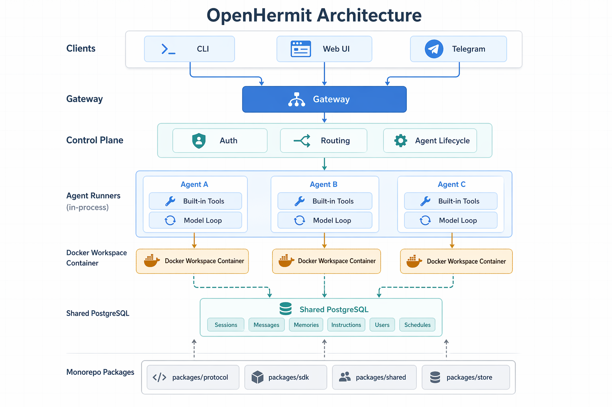

<div align="center">

# OpenHermit

**Agents, but operable.**

Open-source platform for deploying fleets of AI agents as production services — durable state, sandboxed execution, managed at scale, and the channels you already use.

[](https://www.npmjs.com/package/openhermit)
[](LICENSE)
[](https://github.com/williamwa/openhermit/stargazers)
[](https://www.typescriptlang.org/)
[](#contributing)

[**Website**](https://openhermit.ai) · [**Why OpenHermit**](https://openhermit.ai/blog/agents-but-operable) · [**Docs**](docs/) · [**npm**](https://www.npmjs.com/package/openhermit)


</div>

---

## Why OpenHermit

Most CLI-based agents (Claude Code, OpenClaw, Hermes, …) keep their state in files: memories as markdown, sessions as JSONL, skills as folders, secrets as dotfiles. That's perfect for one human at one machine — but it falls apart the moment you stop being one human. Running an internal agent platform for your team, a SaaS where every customer gets their own agent, or a swarm of specialized roles? Files scatter, secrets leak, fleet operations turn into SSH-and-pray.

OpenHermit makes one core design choice: **separate internal state from external state.**

- **Internal state** — sessions, memories, instructions, skills, MCP servers, schedules, secrets, users — lives in shared **PostgreSQL**, scoped by `agent_id`.
- **External state** — the workspace files an agent is currently working on — lives in a per-agent **sandbox**. Pick the backend that fits your deployment: a self-hosted Docker container, or a cloud sandbox provider like [E2B](https://e2b.dev) or [Daytona](https://www.daytona.io).

Once internal state is centralized, fleet operations become trivial:

```bash
hermit skills enable standup-digest --all                       # roll a skill out to every agent
hermit mcp enable mcp_github --all                              # add an MCP server to every agent
hermit instructions append rules "Never share PII." --all       # push a rule to every agent
hermit config secrets set OPENROUTER_API_KEY sk-... --agent main  # rotate a secret
```

📖 [Read the full reasoning →](https://openhermit.ai/blog/agents-but-operable)

---

## Features

- 🚪 **Gateway control plane** — single Hono server. Agents start, attach, detach without orchestration. Admin UI at `/admin/`.
- 🐘 **Postgres-backed state** — sessions, memories, instructions, skills, MCP, schedules, secrets — durable behind Drizzle.
- 🐳 **Sandboxed execution** — per-agent sandbox: self-hosted Docker, E2B, or Daytona. Code runs isolated from the gateway, with the same exec interface across backends.
- 💬 **Channels included** — Telegram, Discord, Slack adapters, plus CLI and Web UI. Enable, disable, reconfigure at runtime.
- 🛠 **Skills & MCP servers** — install centrally, enable per-agent or fleet-wide, audit from one place.
- ⏱ **Schedules & automation** — cron and one-shot jobs with timeout, concurrency policy, and error backoff.
- 👥 **Multi-user with roles** — owner / user / guest. Identity reconciliation across CLI, web, and channels.
- 🔌 **Multi-protocol transport** — HTTP sync, inline SSE streaming, durable SSE, WebSocket RPC.

---

## Architecture



- **Admin** — CLI + Web UI for deploying and operating agents.
- **Client** — Web and CLI for end-users to chat with agents.
- **Channels** — Telegram, Discord, Slack adapters wired into any agent.
- **Gateway** — API, auth, routing, agent lifecycle, schedules.
- **Agent** — Model loop, tools / skills / MCP, sandboxed workspace (Docker / E2B / Daytona).
- **Storage** — PostgreSQL for every kind of internal state.

---

## Installation

```bash
npm install -g openhermit
```

This installs both `hermit` and `openhermit`.

For local development:

```bash
git clone https://github.com/williamwa/openhermit.git
cd openhermit
npm install
```

---

## Quick Start

```bash
# Configure DATABASE_URL, GATEWAY_ADMIN_TOKEN, GATEWAY_JWT_SECRET.
hermit setup

# Start the gateway and the end-user web app.
hermit gateway start
hermit web start

# Check platform health.
hermit status
hermit doctor

# Create and start an agent.
hermit agents create main
hermit agents start main

# Chat through the CLI.
hermit chat --agent main
```

The gateway defaults to `http://127.0.0.1:4000` and serves the admin UI at `/admin/`. The end-user web app runs on `http://127.0.0.1:4310`.

---

## CLI Reference

| Area | Commands |
|------|----------|
| Setup | `hermit setup` |
| Gateway | `hermit gateway start`, `stop`, `run`, `status` |
| Web | `hermit web start`, `stop`, `run`, `status` |
| Agents | `hermit agents list`, `create`, `start`, `stop`, `restart`, `delete` |
| Chat | `hermit chat`, `--agent <id>`, `--resume`, `--session <sessionId>` |
| Config | `hermit config show`, `get`, `set` |
| Secrets | `hermit config secrets list`, `set`, `remove` |
| Instructions | `hermit instructions list`, `get`, `set`, `append`, `remove` — single-agent (`--agent <id>`) or admin fan-out (`--all`) |
| Skills | `hermit skills list`, `assignments`, `scan`, `register`, `delete`, `enable`, `disable` |
| MCP | `hermit mcp list`, `assignments`, `enable`, `disable` |
| Schedules | `hermit schedules list`, `create`, `pause`, `resume`, `delete`, `runs` |
| Operations | `hermit status`, `hermit stats`, `hermit doctor`, `hermit logs [-f] [-n N]` |

Agent-scoped commands accept `--agent <id>` and default to `OPENHERMIT_AGENT_ID` or `main`. Full reference: [docs/cli.md](docs/cli.md).

---

## API Overview

Agent execution routes are exposed under `/api/agents/{agentId}`:

- `POST /api/agents/{id}/sessions`
- `GET /api/agents/{id}/sessions`
- `POST /api/agents/{id}/sessions/{sessionId}/messages`
- `POST /api/agents/{id}/sessions/{sessionId}/messages?wait=true`
- `POST /api/agents/{id}/sessions/{sessionId}/messages?stream=true`
- `GET /api/agents/{id}/sessions/{sessionId}/events`
- `POST /api/agents/{id}/sessions/{sessionId}/approve`
- `POST /api/agents/{id}/sessions/{sessionId}/checkpoint`
- `DELETE /api/agents/{id}/sessions/{sessionId}`
- `ws://host/api/agents/{id}/ws`

Admin and owner-facing management endpoints live under `/api/admin/...` and `/api/agents/{agentId}/...`. Channel webhooks land at `POST /api/agents/{id}/channels/{namespace}/webhook`.

See [docs/transport-protocol.md](docs/transport-protocol.md), [docs/skills.md](docs/skills.md), [docs/mcp-servers.md](docs/mcp-servers.md), and [docs/channel-adapter.md](docs/channel-adapter.md).

---

## Internal State

All durable internal state is scoped by `agent_id` where applicable:

| Store | Contents |
|-------|----------|
| Agents | Registered agents, runtime config, security policy, workspace dirs |
| Sessions | Metadata, status, participants, working memory, descriptions |
| Session events | User, assistant, tool, error, channel, and introspection events |
| Memories | Long-term memory with PostgreSQL FTS plus ILIKE fallback |
| Instructions | Agent identity, behavior, and rules included in prompts |
| Users | Users, identities, roles, and merge links |
| Sandboxes | Per-agent sandbox rows (docker / e2b / daytona) with lifecycle and runtime state |
| Skills | Skill library and per-agent/global assignments |
| MCP servers | External MCP server definitions and assignments |
| Channels | Built-in and external channel rows with encrypted tokens |
| Secrets | Per-agent provider/integration secrets, encrypted at rest |
| Schedules | Cron/once jobs and run history |

Secrets are encrypted with `OPENHERMIT_SECRETS_KEY` (AES-256-GCM); without that key the gateway falls back to per-agent `secrets.json` for local dev. The only per-agent files on disk are the workspace at `~/.openhermit/workspaces/{agentId}/`; enabled skills are synced into each backend's own `<agent_home>/.openhermit/skills/system/` (bind-mounted for docker, uploaded via SDK for e2b/daytona).

---

## Repository Structure

```text
openhermit/
├── apps/
│   ├── agent/                # AgentRunner, tools, runtime, scheduler, channels
│   ├── gateway/              # Control plane, auth, admin API, admin UI
│   ├── cli/                  # Published `hermit` / `openhermit` CLI
│   ├── web/                  # End-user browser chat app
│   └── channels/
│       ├── telegram/         # Telegram adapter
│       ├── discord/          # Discord adapter
│       └── slack/            # Slack adapter
├── packages/
│   ├── protocol/             # Shared protocol types and route builders
│   ├── sdk/                  # HTTP/SSE/WebSocket clients
│   ├── shared/               # Common env, errors, URL helpers
│   └── store/                # Drizzle schema and PostgreSQL store implementations
├── skills/                   # Built-in OpenHermit skills registered by the gateway
└── docs/                     # Architecture and operation docs
```

---

## Development

```bash
npm run dev:gateway          # Gateway and admin UI API at http://127.0.0.1:4000
npm run dev:web              # End-user web app at http://127.0.0.1:4310
npm run dev:cli              # CLI from source
npm run dev:studio           # Drizzle Studio for the configured database
npm run typecheck            # Type-check all workspaces
npm test                     # Build and run test suites
```

Important environment variables:

| Variable | Description |
|----------|-------------|
| `DATABASE_URL` | PostgreSQL connection string |
| `DATABASE_URL_TEST` | Test PostgreSQL connection string used by `npm test` |
| `GATEWAY_ADMIN_TOKEN` | Bearer token for admin APIs and CLI management |
| `GATEWAY_JWT_SECRET` | JWT signing secret for user/device tokens |
| `GATEWAY_HOST` | Gateway listen host, default `127.0.0.1` |
| `GATEWAY_PORT` / `PORT` | Gateway port, default `4000` |
| `OPENHERMIT_SECRETS_KEY` | AES-256-GCM key used to encrypt `agent_secrets` and channel tokens at rest |
| `OPENHERMIT_TOKEN` | CLI token, usually the admin token |
| `OPENHERMIT_GATEWAY_URL` | Gateway URL, default `http://127.0.0.1:4000` |
| `OPENHERMIT_AGENT_ID` | Default CLI agent ID, default `main` |
| `OPENHERMIT_WEB_PORT` | End-user web app port, default `4310` |

---

## Documentation

- [CLI Reference](docs/cli.md)
- [Architecture](docs/architecture.md)
- [Plugins & Hooks (design draft)](docs/plugins.md)
- [Storage Model](docs/storage-model.md)
- [Session Model](docs/session-model.md)
- [User Model](docs/user-model.md)
- [Memory Model](docs/memory-model.md)
- [Sandbox Model](docs/sandbox-model.md)
- [Transport Protocol](docs/transport-protocol.md)
- [Tools](docs/tools.md)
- [Skills](docs/skills.md)
- [MCP Servers](docs/mcp-servers.md)
- [Channel Adapters](docs/channel-adapter.md)
- [Introspection Design](docs/introspection-design.md)
- [Architecture Decisions](docs/decisions.md)
- [Shipped Features](docs/plan.md)
- [Roadmap](docs/roadmap.md)
- [Open Questions](docs/pending-decisions.md)

---

## Contributing

OpenHermit is open source (MIT) and very much a work in progress. If the internal/external state split, the fleet operations model, or agents-as-services resonates with you — we'd love your help.

Issues, PRs, design discussions, channel adapters, skills, MCP integrations, docs, and war stories from running it in your own setup are all welcome.

- Open an issue: [github.com/williamwa/openhermit/issues](https://github.com/williamwa/openhermit/issues)
- Start a discussion: [github.com/williamwa/openhermit/discussions](https://github.com/williamwa/openhermit/discussions)
- Or just star the repo if you'd like to see where this goes ⭐

---

## License

MIT © [William Wang](https://github.com/williamwa)
